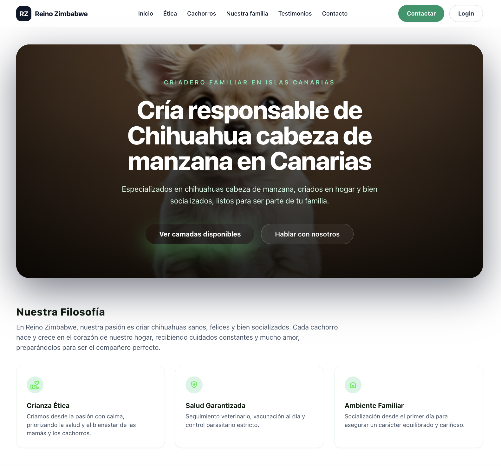
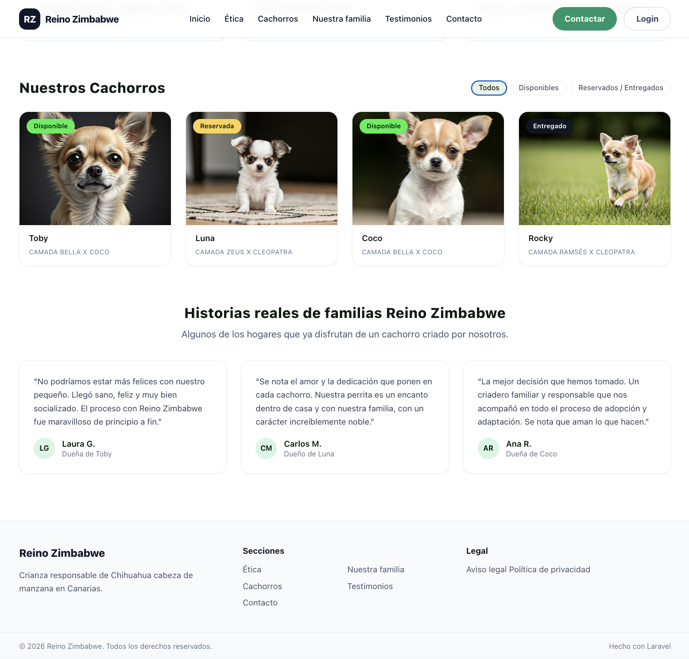
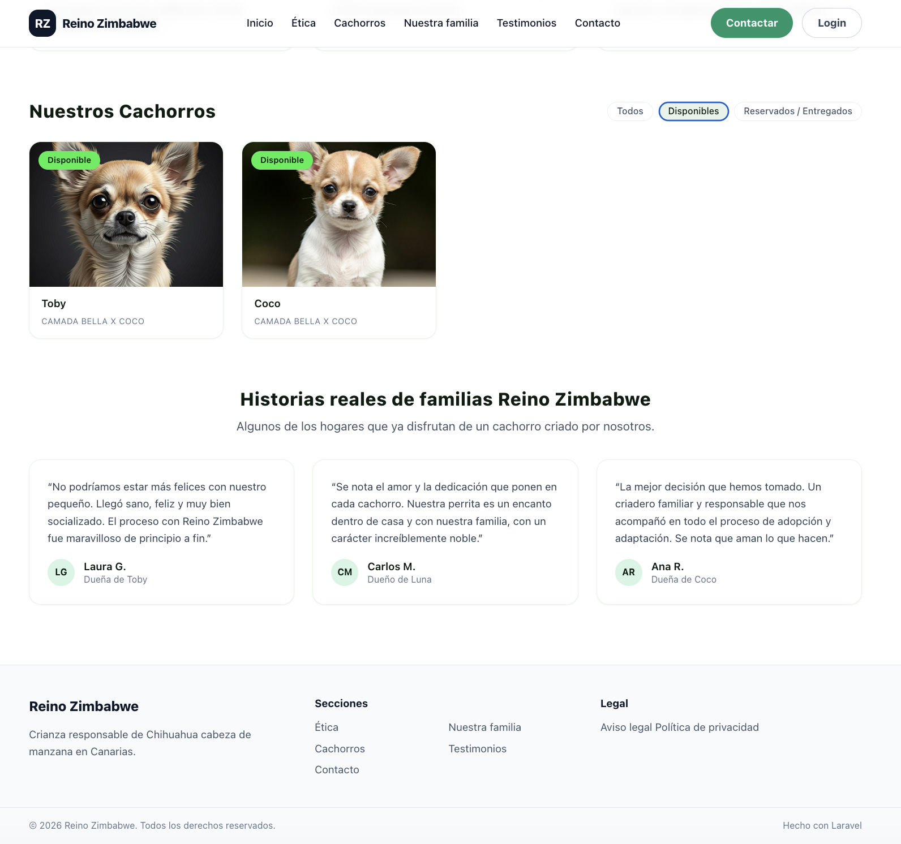
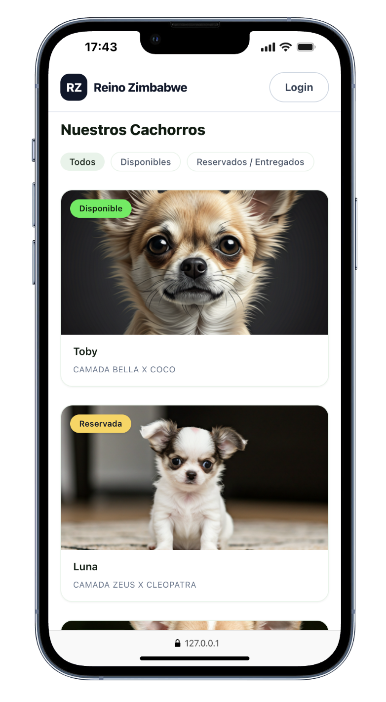
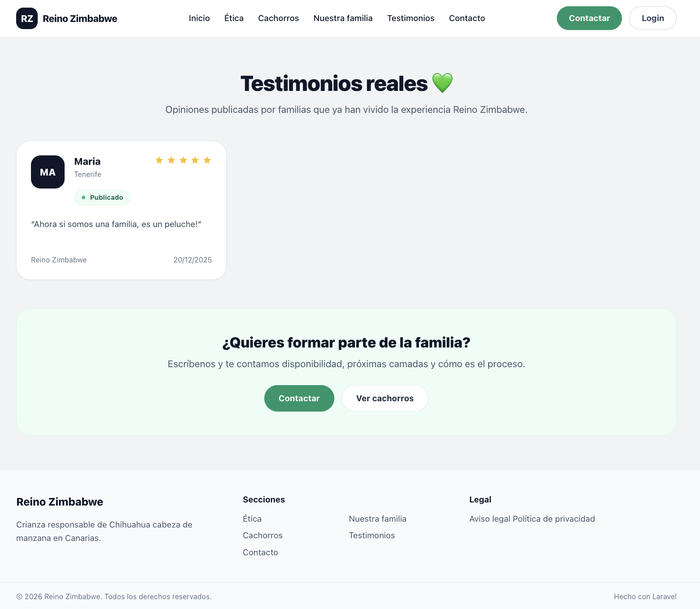
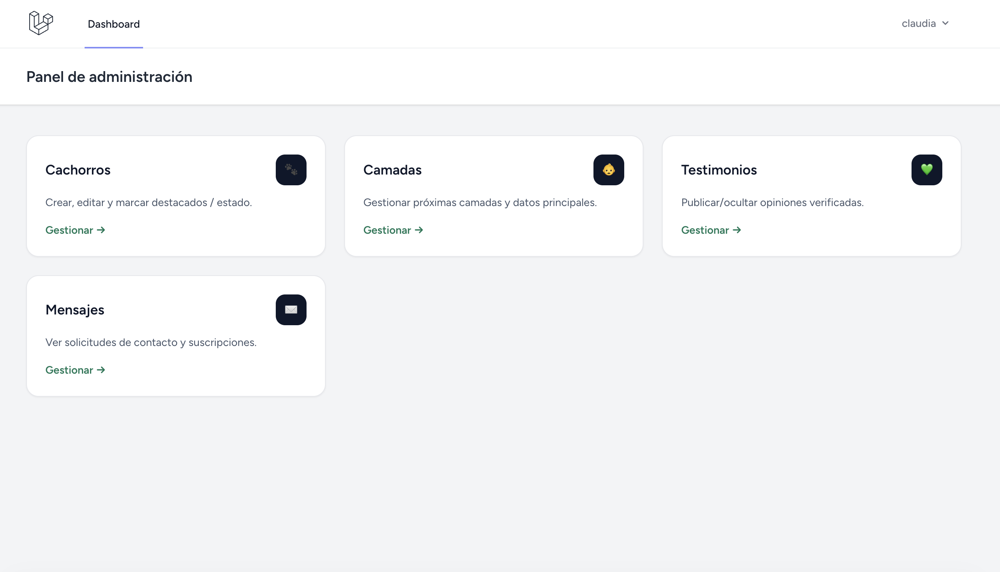

# Reino Zimbabwe

Reino Zimbabwe es un proyecto **frontend con backend real**, diseñado como un producto completo para un criadero familiar de chihuahuas.

El proyecto pone el foco en **experiencia de usuario, diseño visual e interacciones**, integradas dentro de una arquitectura Laravel funcional, con panel de administración y estados reales.

---

## ✨ Qué demuestra este proyecto

- Diseño visual con identidad propia
- Maquetación cuidada y totalmente responsive
- Interacciones frontend (filtros dinámicos, estados visuales)
- Integración de frontend moderno en Laravel (Blade + Alpine)
- Separación clara entre parte pública y panel de administración
- Atención al detalle y coherencia estética

---

## 🧩 Tech Stack

- HTML5  
- Tailwind CSS  
- JavaScript  
- Alpine.js  
- Laravel  
- Vite  

---

## 🧠 Enfoque del proyecto

Este proyecto está orientado a demostrar:

- Pensamiento de producto y UX
- Capacidad para diseñar interfaces con personalidad
- Frontend integrado en backend real (sin SPA)
- Gestión de estados visuales (disponible, reservado, entregado)
- Estructura limpia y escalable

No es una aplicación CRUD genérica, sino una **experiencia visual interactiva** con lógica real de negocio.

---

## 👩‍💻 Mi rol

**Frontend Developer**

- Diseño visual y conceptual
- Maquetación y responsive
- Interacciones UI (filtros, estados, feedback visual)
- Integración frontend en entorno Laravel
- Colaboración con backend para estados y contenido dinámico

---

## 🚀 Cómo ejecutar el proyecto en local

Este proyecto utiliza **Laravel + Vite**, por lo que requiere levantar dos procesos.

### Backend
```bash
php artisan serve

### Frontend
```bash
npm install
npm run dev

📌 Este proyecto forma parte de mi portfolio personal y está enfocado a demostrar capacidades frontend aplicadas a un producto real.

## 🖼️ Capturas del proyecto

### Página principal (Home)


---

### Filtros dinámicos de cachorros


---

### Filtros por estado (disponible / reservado / entregado)


---

### Vista móvil


---

### Contenido público completo


---

### Panel de administración



© 2026 · Claudia