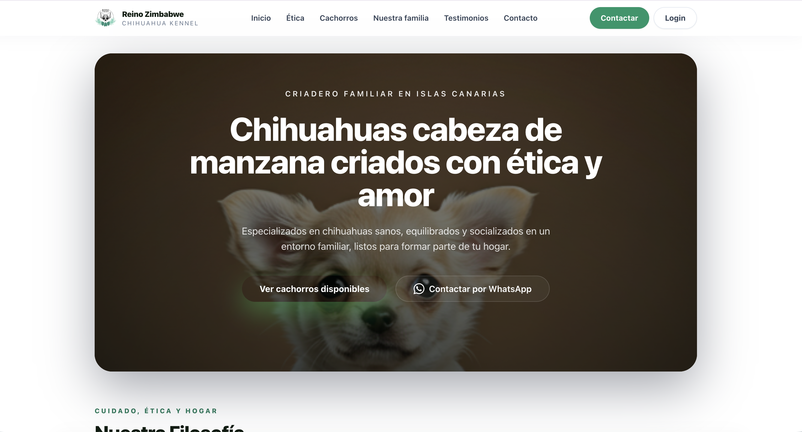
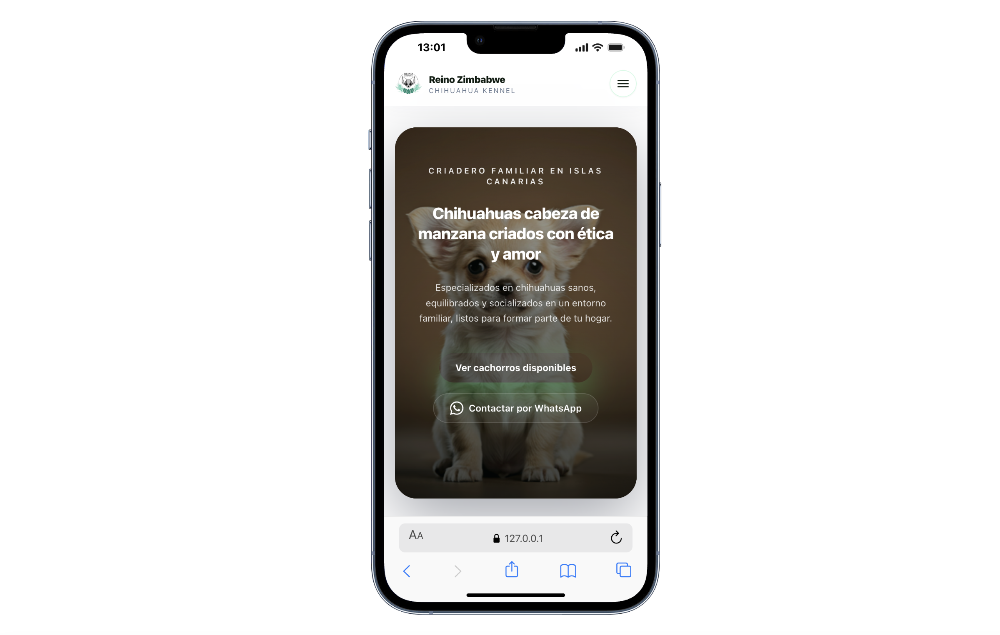
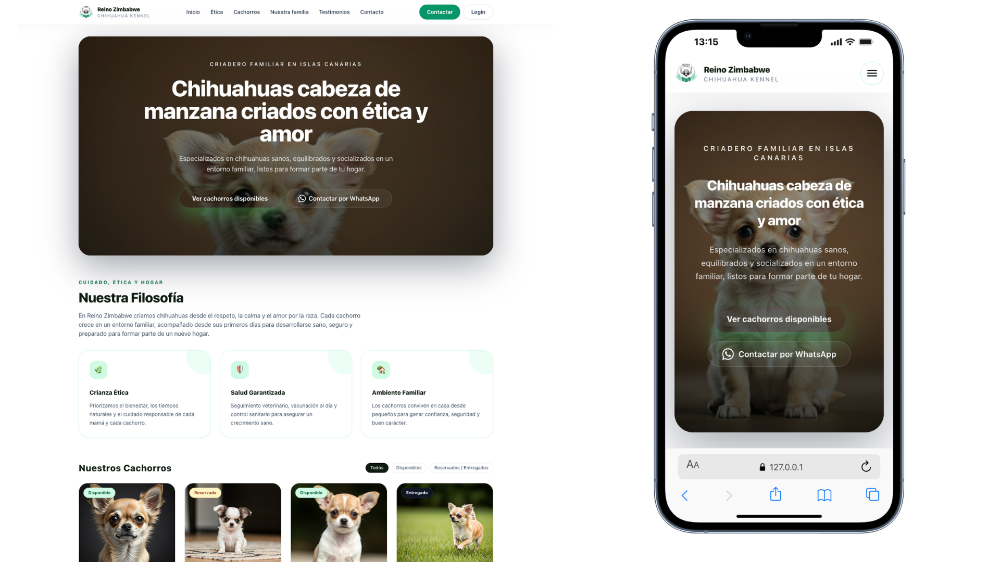
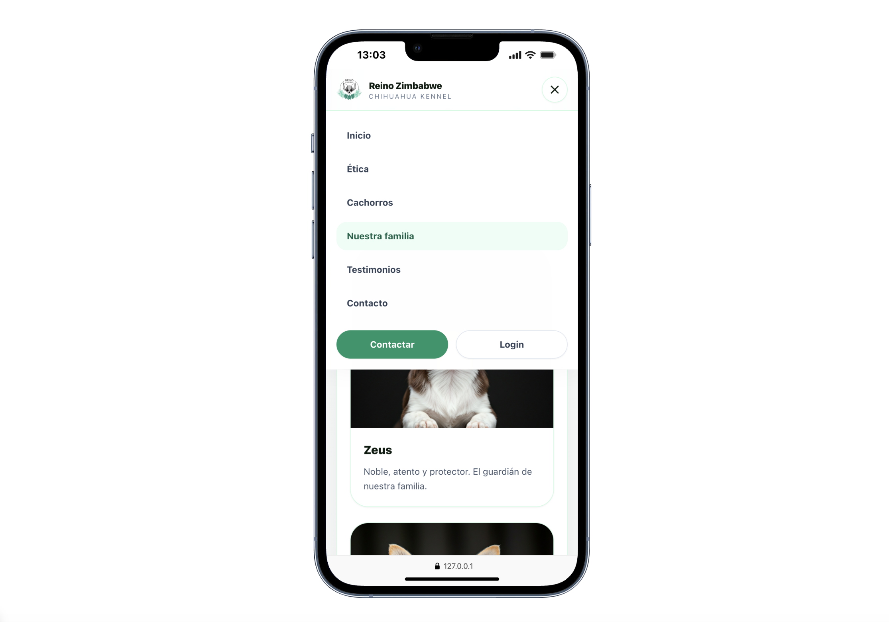
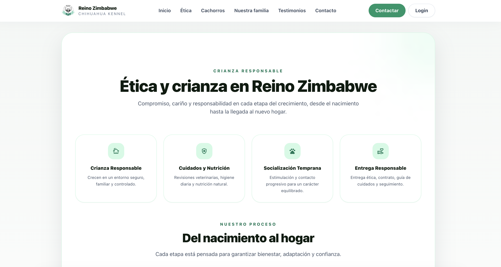
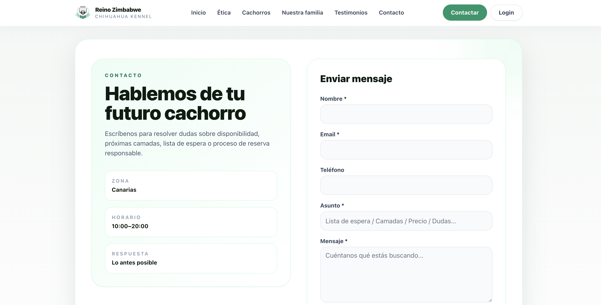
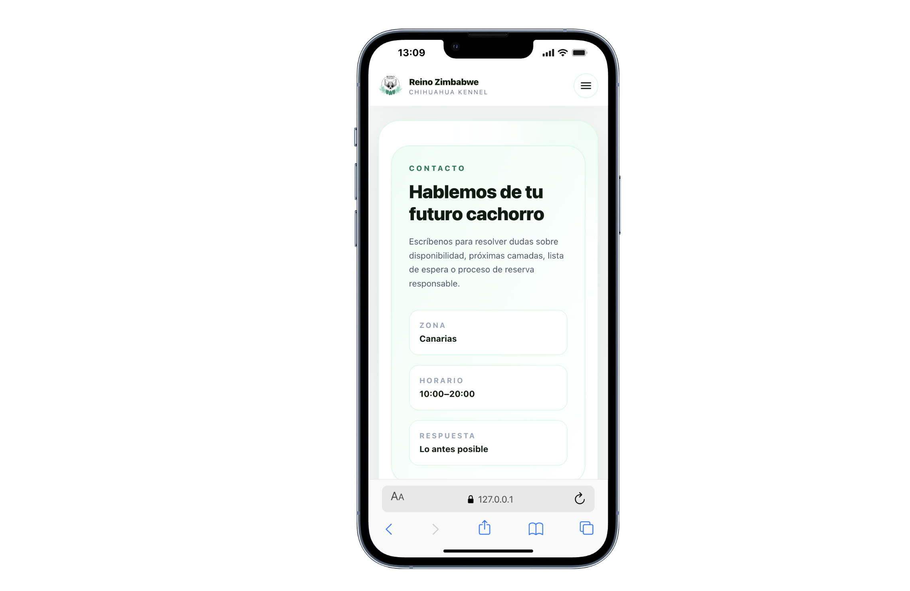
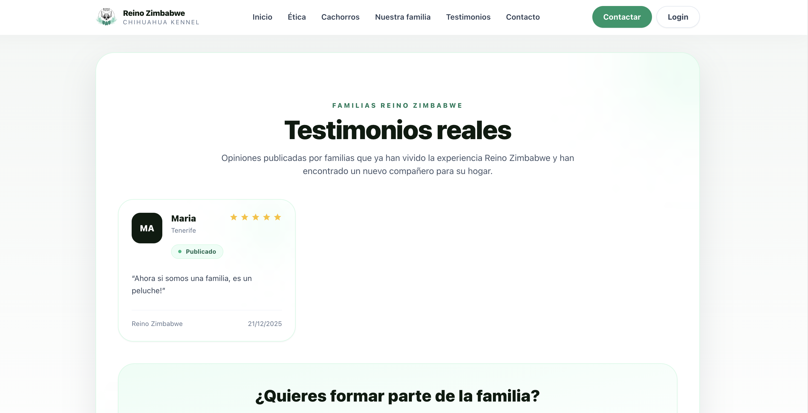

# Reino Zimbabwe — Chihuahua Kennel Platform

Modern full-stack web platform for a responsible Chihuahua breeder brand, focused on trust, user experience, and responsive design.

Built with Laravel, Blade Components, Tailwind CSS and responsive-first UI principles.

## Overview

Reino Zimbabwe is a modern breeding website designed to present available puppies, ethical breeding values, testimonials, and contact flows in a clean and emotionally warm experience.

The project combines:
- premium landing-page aesthetics,
- responsive layouts,
- reusable Blade architecture,
- dynamic admin-ready structure,
- and polished UI/UX decisions inspired by modern product websites.

## Tech Stack

### Backend
- Laravel
- Blade Components
- PHP

### Frontend
- Tailwind CSS
- Vite
- Responsive-first design
- Mobile navigation system
- Reusable UI sections


## Features

- Responsive landing page
- Modern hero section
- Ethical breeding presentation
- Puppy showcase cards
- Testimonials section
- Contact form
- Newsletter / waiting-list subscription
- Mobile slide-down navigation
- Reusable layout architecture
- Admin authentication structure prepared


## UI/UX Focus

This project was heavily focused on:
- visual hierarchy,
- spacing consistency,
- premium card layouts,
- responsive balance,
- accessibility-friendly contrast,
- and emotional brand presentation.

The goal was to create a website that feels trustworthy, modern, and professional while maintaining warmth and personality.

## Screenshots

### Home — Desktop


### Home — Mobile


### Responsive Showcase


### Mobile Navigation


### Ethics Section


### Contact — Desktop


### Contact — Mobile


### Testimonials



## Installation

Clone the repository:

```bash
git clone <repository-url>
```

## Install dependencies

```bash
composer install
npm install
```

## Create environment file

```bash
cp .env.example .env
```

## Generate application key

```bash
php artisan key:generate
```

## Run migrations

```bash
php artisan migrate
```

## Start development environment

In development mode, Laravel and Vite must run simultaneously.

```bash
php artisan serve
```

```bash
npm run dev
```

---

## Production Build

For production environments, compile frontend assets using:

```bash
npm run build
```

Laravel will serve the compiled assets directly from:

```text
public/build
```

## Future Improvements
- Admin dashboard improvements
- Real puppy management system
- Image galleries
- Email notifications
- CMS integration
- Blog/news section
- Real testimonial management
- SEO optimization
- Production deployment

## Author

Developed by Claudia Aguilar

Frontend-focused developer specialized in building modern responsive web applications with strong UI/UX attention and real-world product thinking.
